# RabbitMQ
消息队列相关调研，整理，代码片段

**消息队列RabbitMQ**

消息队列简介
============

何谓消息队列
------------

本质是个队列，先进先出

连接的容器

*提供路由服务，类似邮局*

为什么要用消息队列
------------------

**解决的问题**

异步

*异步（减少等待时间）*

解耦

*解耦（系统拆分，跨语言，基于amqp协议）*

并发性

*并发性（缓冲器）*

背景简介
--------

AMQP

AMQP，即Advanced Message Queuing
Protocol,一个提供统一消息服务的应用层标准高级消息队列协议,是应用层协议的一个开放标准,为面向消息的中间件设计。

*AMQP的原始用途只是为金融界提供一个可以彼此协作的消息协议，而现在的目标则是为通用消息队列架构提供通用构建工具。*

RabbitMQ是实现了高级消息队列协议（AMQP）的开源消息代理软件，服务器是用Erlang语言编写的。

*Erlang是一个结构化，动态类型编程语言，内建并行计算支持。最初是由爱立信专门为通信应用设计的，比如控制交换机或者变换协议等，因此非常适
合于构建分布式，实时软并行计算系统。使用Erlang编写出的应用运行时通常由成千上万个轻量级进程组成，并通过消息传递相互通讯。*

RabbitMQ的优点
--------------

实现了AMQP标准的代理服务器

基于Erlang，集群设置非常简单

更可靠，防止崩溃

*缺点：RabbitMQ 在有大量消息堆积的情况下性能会下降*

全面认识消息队列
================

名词解释
--------

Broker：简单来说就是消息队列服务器实体（中间人）。

Exchange：消息交换机，它指定消息按什么规则，路由到哪个队列。

Queue：消息队列载体，每个消息都会被投入到一个或多个队列。

Binding：绑定，它的作用就是把exchange和queue按照路由规则绑定起来。

Routing Key：路由关键字，exchange根据这个关键字进行消息投递。

vhost：虚拟主机，一个broker里可以开设多个vhost，用作不同用户的权限分离。

producer：消息生产者，就是投递消息的程序。

consumer：消息消费者，就是接受消息的程序。

channel：消息通道，在客户端的每个连接里，可建立多个channel，每个channel代表一个会话任务。

AMQP模型简介
------------

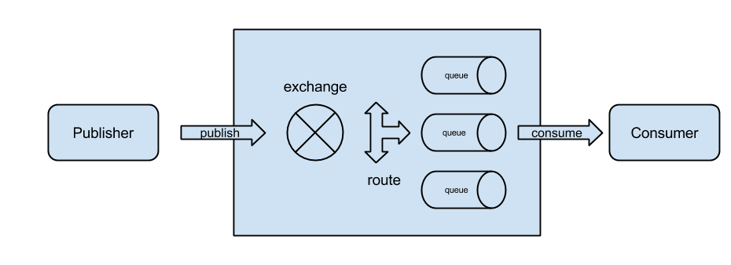

消息代理(message brokers)从发布者/生产者(publishers/producers)接收消息，然后根据

既定的路由规则把接收到的消息发送给消息的处理者，即消费者(consumers)。

*消息代理(message brokers)包括两部分，交换机(exchange)和队列(queue)。*

*发布者(publisher)发布消息(message)时可以为消息设置很多属性(message
meta-data)。*

*消息到达交换机(exchange)之后，交换机参照这些属性将消息路由到合适的队列(queue)*

*中去。*

生产者创建消息
--------------

消息组成：

有效载荷（payload）

标签（label）

*有效载荷（payload）——数据，任何内容*

*标签（label）——描述消息，用于决定发到哪个队列*

消费者消费消息
--------------

连接到RabbitMQ，并订阅到队列上。每当消息进入队列，就会发到队列上的消费者。

*消费者只接收消息的有效载荷*

*多个消费者订阅到同一个队列上，将以循环方式发送给消费者。*

消费方式
--------

消息订阅

单条获取

*订阅模式*

*订阅消息后，消费者在消费或拒绝消费消息后，就能从队列中自动接收下一条消息。*

*单条获取方式*

*某些时候只想从队列拿取一条消息而不是持续订阅，可用使用这种方式。*

*为什么不能循环basic.get实现持续订阅？队列和消费者之间是依靠信道保持通讯，订阅模式长期开启信道，而单条获取每次获取之后会关闭信道，mq中开启关闭信道是消耗资源的，会影响rabbit的吞吐能力*

一些特点
--------

Publisher指明谁可以收到消息（routing key）而不具体指定某个Queue；

Consumer只是纯粹的监听Queue而不会关心数据从何而来。

当消息到达了无人订阅的队列，消息会一直留在队列中，一旦有消费者订阅队列，会立刻分发给消费者。

当多个消费者同时订阅一个队列，RabbitMQ会轮询方式找到空闲消费者。

*当消费者A拿到消息1处理并确认处理完成时，消息1就会从队列中删除，那么，消费者B就不会再拿到消息1了。*

消息发送是有序的

消息确认
--------

两种确认方式

1.通过basic.ack命令向RabbitMQ发送一个确认

2.订阅队列时设置auto\_ack为ture，即一旦接到消息就自动确认。

*从安全性考虑，网络并不可靠，接收消息的应用也可能出错。基于此AMQP模型中包含了消息确认(message
acknowledgements)的概念，即消息从队列投递到消费者手中之后，消费者会返回给消息代理一个确认消息，该过程可以为自动的也可以由应用来执行。该机制启用之后，消息代理不会将消息从队列中删除，除非收到了确认消息。*

*消息没有确认（ack），RabbitMQ会分发给下一个消费者*

*消息未确认之前，RabbitMQ不会发送新的消息给当前消费者*

*消息未确认时，如果消息已经读取到客户端，并且正在执行处理逻辑中，程序崩溃，没有ack，消息不会从队列中删除，重连程序后还可以继续消费，或者分发给下一个消费者。*

*建议不要设置自动确认，参考墨菲定律，处理消息的业务逻辑即便写的再完美，还是会有极端情况会逻辑中断，尽量全部在消息处理完毕时再主动进行ack操作。*

消息拒绝
--------

**拒绝消息的几种方式：**

1.  消费者断开连接（会增加RabbitMQ的负担）

2.  使用AMQP的basic.reject命令（RabbitMQ2.0+），并将requeue的参数设置为false，将消息从队列中移除

3.  直接回复basic.ack命令

*2会支持“死信”队列，便于问题排查*

连接与通道
----------

AMQP连接是基于TCP的长连接。

当一个应用需要断开到消息代理的连接时，需要优雅的释放连接,而不是直接关闭。

AMQP提供了通道来应对多连接的情况，同一个TCP连接中可以存在多个相互隔离的通道。通道不可被多个线程/进程共享。

*当应用需要与消息代理建立多个连接的时候，同时开多个TCP连接会带来一定程度的资源*

*浪费，防火墙配置也将变得复杂。*

虚拟主机
--------

为了在一个单独的代理上实现多个隔离的环境（用户、用户组、交换机、队列 等），AMQP

提供了一个虚拟主机（virtual hosts – vhosts）的概念。

*这跟Web
servers虚拟主机概念非常相似，这为AMQP实体提供了完全隔离的环境。当连接被建立的时候，AMQP客户端来指定使用哪个虚拟主机。*

交换器和绑定
------------

消息不是直接发送到队列，而是根据路由键（routing\_key）将消息从交换器（exchange）路由到队列（queue）

绑定——交换机将消息路由给队列所遵循的规则。

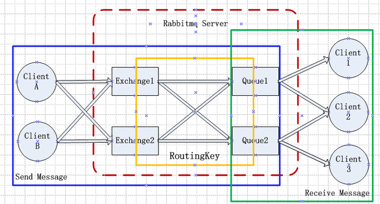

*当消息无法路由到队列时，AMQP会将消息销毁或者返回给发布者，具体取决于消息所携带的属性。*

**direct**

*根据消息携带的路由关键字投递到对应队列的，用来处理消息的单播路由。*

*一对一*

**direct场景举例**

**fanout**

*广播，各个队列实现不同功能*

*将消息路由到绑定在其身上的所有队列，用来处理消息的广播路由。*

*允许你对单条消息做不同方式的反应，将不同队列绑定到此交换器上*

*任何发送到Fanout
Exchange的消息都会被转发到与该Exchange绑定(Binding)的所有Queue上。*

*这种模式不需要RouteKey*

*这种模式需要提前将Exchange与Queue进行绑定，一个Exchange可以绑定多个Queue，一个Queue可以同多个Exchange进行绑定。*

*这种模式转发消息是最快的，因为不需要匹配路由键。*

**fanout场景举例**

新用户注册成功：

目前的实现：写死在注册controller里

解耦的思想，各个操作模块互不影响，不会因为一个模块出现问题而影响其他。

**topic**

*任何发送到Topic Exchange的消息都会被转发到所有关心RouteKey中指定话题的Queue上*

*这种模式需要RouteKey，也许要提前绑定Exchange与Queue*

**topic场景举例**

*日志分类处理*

*所有类型的日志均进行记录*

*异常情况日志进行微信报警*

*\*由于fanout类型缺少了路由键匹配，消息的送达会更加快速*

持久化
------

交换器持久化

队列持久化

消息持久化

设置delivery mode，1：非持久化，2：持久化

*默认配置都是非持久化的，当我们重启rabbit服务器，交换器和队列就会消失，当然，里面的消息也会消失。*

*设置之后，服务器重启，交互器和队列会保留，但是消息还是会丢失。*

*消息设置持久化， 队列和交换器也必须持久化。*

*所以还要设置消息的持久化，消息是存储在本地磁盘，当发送一条消息，首先会存储，然后再投递至交换器。
影响性能。*

蜜芽API RabbitMQ使用场景
========================

1.  激活成功后，写激活表数据

>   [./media/image13.png](./media/image13.png)

>   [./media/image14.png](./media/image14.png)

1.  注册完成，回写user\_id，设备信息

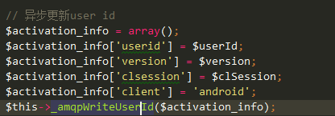

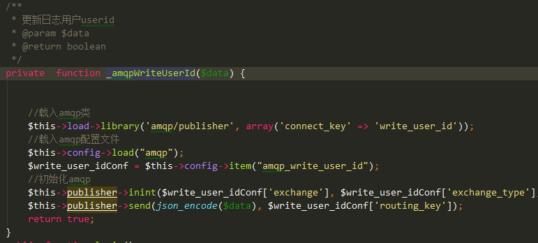

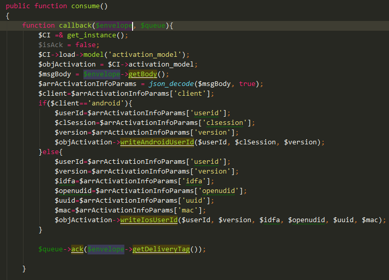

1.  兑换乐园券成功后发送短信

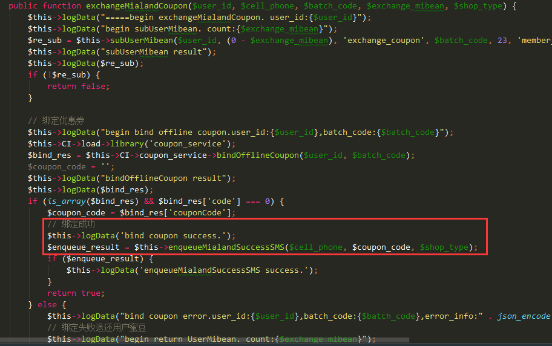

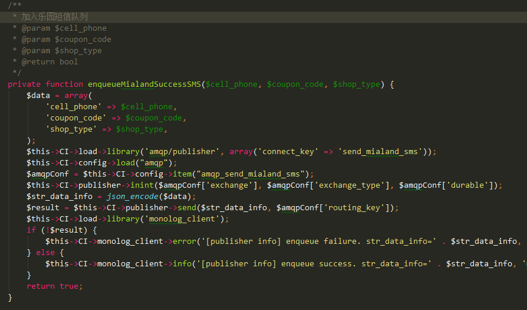

RabbitMQ进阶管理与性能优化
==========================

管理工具与监控
--------------

### 官方web监控页面

地址：http://127.0.0.1:15672

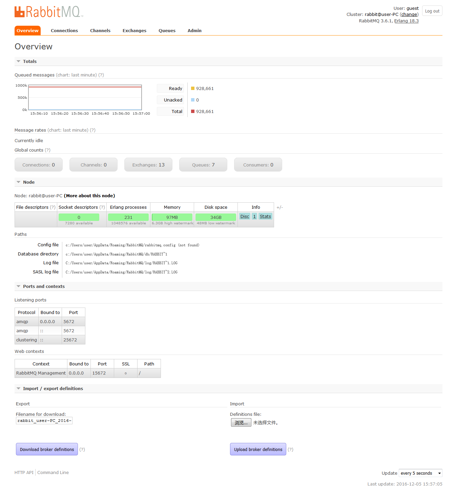

队列详情面板：

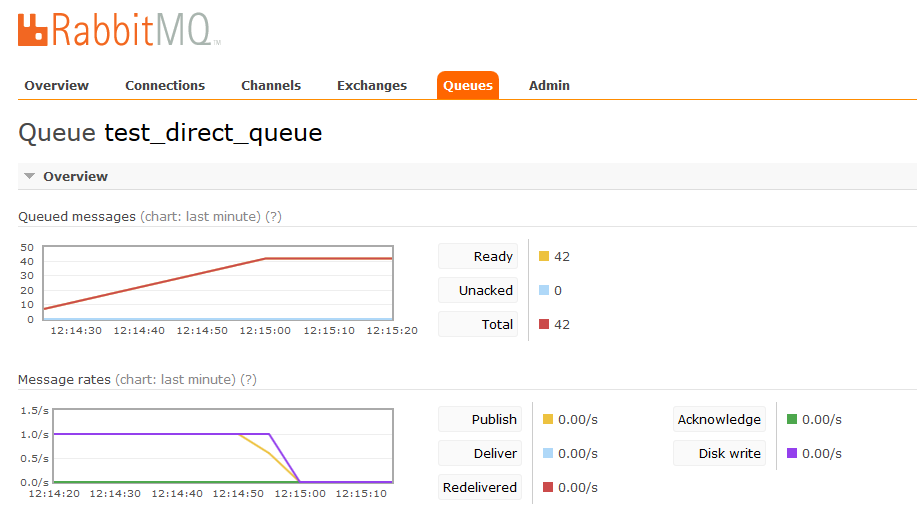

队列列表：

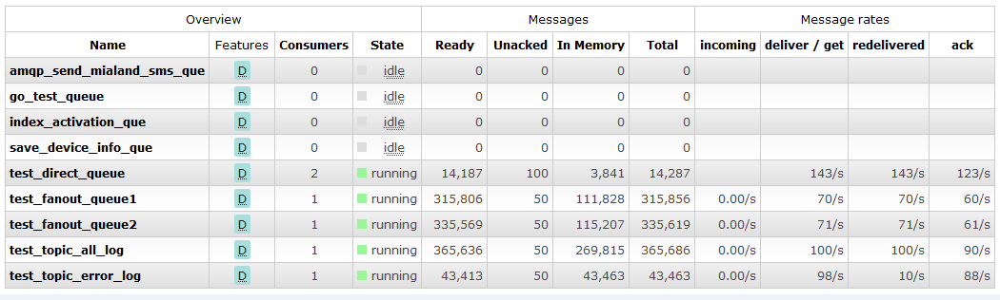

web管理界面方便进行数据查看与简单操作

### HTTP API管理

参考管理页面的API说明： http://127.0.0.1:15672/api/

**API示例：**

<http://localhost:15672/api/queues/%2f/test_direct_queue>

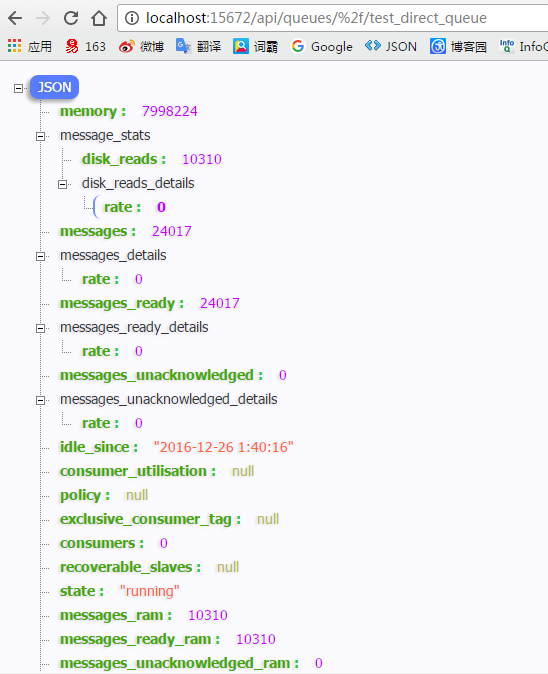

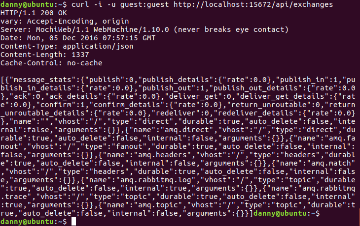

### 命令行管理

command line方式，用python封装了相关API，更好的格式化输出

参考：http://127.0.0.1:15672/cli/

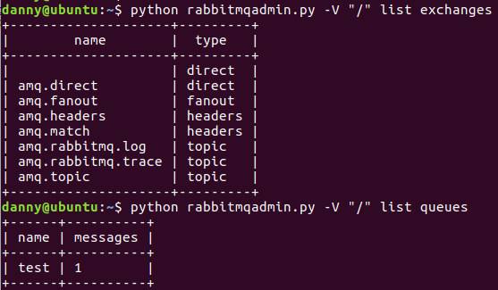

### 队列监控

需要考虑的地方：

1.队列是否可用，可以构造监控队列进行模拟的生产和消费。

2.监控队列消息的堆积数，达到警戒值报警。

流量控制机制
------------

流量过大，主动阻塞

内存超过限制

磁盘剩余空间低

*蓄水池理论*

*主动阻塞住发消息太快的连接,这个无法调整,如果被阻塞了,在abbitmqctl
控制台上会显示一个blocked的状态*

*内存超过限量,会阻塞连接,在vm\_memory\_high\_watermark可调*

*剩余磁盘在限定以下mq会
主动阻塞所有的生产者,默认为50mb,在disk\_free\_limit可调.*

性能优化建议
------------

应当尽量让队列保持为空，如果消费者开始滞后，队列开始被填满的时候，服务器会收到内存报警，并开始将消息写入磁盘（忽视发布消息时设置的参数）

当消息发送的速率超过了RabbitMQ的处理能力时该怎么办？

RabbitMQ会自动减慢这个连接的速率，让client端以为网络带宽变小了，发送消息的速率会受限，从而达到流控的目的。
使用”rabbitmqctl
list\_connections”查看连接，如果状态为“flow”，则说明这个连接处于flow-control
状态。

自定义配置RabbitMQ
------------------

RabbitMQ 的配置有三个来源：环境变量，配置文件和运行时参数。

**环境变量 **

RabbitMQ 的环境变量定义在 /etc/rabbitmq/rabbitmq-env.conf 中,位置不可指定。

包含了各种设置项，可以用于覆盖在 RabbitMQ 启动脚本中默认设置的相关选项。

*RabbitMQ对环境变量的解析顺序为：*

*1.首先是在 shell 中形如 RABBITMQvarname 的变量*

*2.其次是在配置文件 rabbitmq-env.conf 中 var\_name 变量*

*3.最后是 RabbitMQ 中预定义的默认值*

*例如，对于 RABBITMQ\_NODENAME 的设置，首先会从环境变量中进行检查
RABBITMQ\_NODENAME 的值，如果其中没有该变量的定义或者其值等于空字符串，则接着从
/etc/rabbitmq/rabbitmq-env.conf 中检查 NODENAME
的值，如果其中没有该变量的定义或者其值等于空字符串，则最后取用启动脚本中设置的默认值。*

*文件 /etc/rabbitmq/rabbitmq-env.conf 中的变量名总是和去掉了 RABBITMQ\_
前缀的相应环境变量名相同*

**配置文件**

RHEL/CentOS 下配置文件默认即是 /etc/rabbitmq/rabbitmq.config。

该配置文件的位置可配，指定环境变量 RABBITMQCONFIGFILE

或者在 /etc/rabbitmq/rabbitmq-env.conf 中定义 CONFIG\_FILE 都可以。

该配置文件默认不存在，需要手工添加。

**运行时参数**

还有另外一类特定的配置参数，要么它需要保持在所有 rabbitmq 节点上保持一致，

要么它在运行时会发生变化，这类参数可以使用 rabbitmqctl 来配置。

rabbitmqctl set\_parameter {-p vhost} component\_name name value

rabbitmqctl clear\_parameter {-p vhost} component\_name name

rabbitmqctl list\_parameters {-p vhost}

参数调优
--------

vm\_memory\_high\_watermark：表示RabbitMQ使用内存的上限为系统内存的40%。也可以通过absolute参数制定具体可用的内存数

当RabbitMQ使用内存超过这个限制时，RabbitMQ 将对消息的发布者进行限流，直到内存占用回到正常值以内。

可以修改rabbitmq-env.conf配置文件：

[{rabbit,[{vm\_memory\_high\_watermark,0.6}]}].

或者设置成固定值：

[{rabbit,[{vm\_memory\_high\_watermark,{absolute,1073741824}}]}].也就是1024MB.

如果要在broker运行过程中修改，则rabbitmqctl set\_vm\_memory\_high\_watermark 0.6

queue\_index\_embed\_msgs\_below

queue\_index\_embed\_msgs\_below：RabbitMQ
3.5版本引入了将小消息直接存入队列索引（queue\_index）的优化，消息持久化直接在amqqueue进程中处理，不再通过msg\_store进程。由于消息在5个内部队列中是有序的，所以不再需要额外的位置索引(msg\_store\_index)。该优化提高了系统性能10%左右。

hipe\_compile：开启Erlang
HiPE编译选项（相当于Erlang的jit技术），能够提高性能20%-50%。在Erlang
R17版本后HiPE已经相当稳定，RabbitMQ官方也建议开启此选项。

总结
====

异步思维，解耦思维，并发缓冲，尝试新的思维模式。

